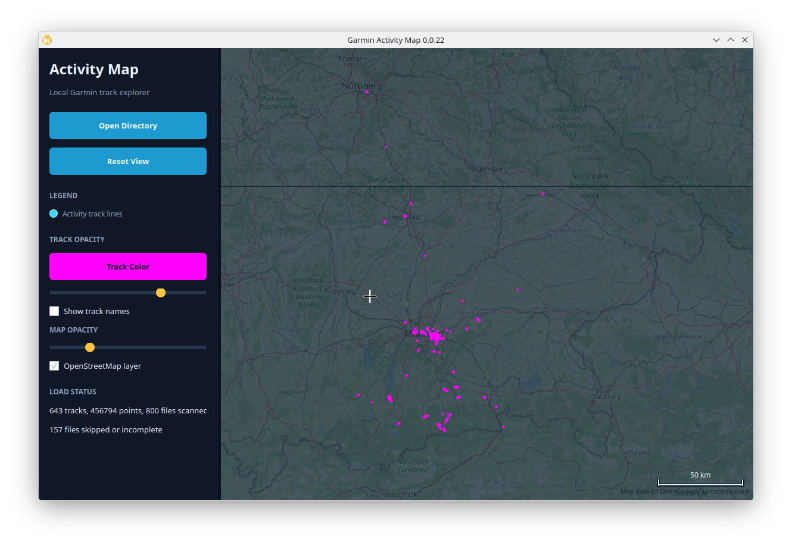

# Garmin Activity Map

A private-first archive tool for turning a Garmin Connect account into a local, reusable activity dataset. It pulls activity summaries and detail payloads into JSON files so future analysis, dashboards, and visualizations can work from your own disk instead of repeatedly touching the Garmin service.

## TL;DR

After completing the setup below, export all activities from 2017 through 2026:

```bash
export GARMIN_EMAIL='garmin-user@example.com'
./exportGarminYears.sh --start-year 2026 --end-year 2017
```

Enter your Garmin password and MFA code when prompted. The export is resumable,
so the same command can be run again after an interruption.

Open all exported years in the map:

```bash
source .venv/bin/activate
python -m activity_map data/garmin
```



## Project Information

**Author: Marcel Petrick <mail@marcelpetrick.it>**

**Note: projected is generated with AI.**

**License: GPLv3 or later. See `LICENSE`.**

- Version: `0.0.42`
- Runtime: Python 3.11+

## Usage Terms

This project is distributed under the GNU General Public License v3.0. You may use, study, modify, and redistribute it under the terms of GPLv3.

## Setup

```bash
python -m venv .venv
source .venv/bin/activate
python -m pip install -r requirements.txt
```

Set `GARMIN_EMAIL` in your shell or in ignored local `.env`. The password is always entered manually at runtime and is not read from files or environment variables.

```bash
read -r GARMIN_EMAIL
export GARMIN_EMAIL
```

## Export

```bash
python -m garmin_export
```

By default, exported data is written under `data/garmin/activities/`, which is ignored by git. Authentication tokens are stored outside the repository by the `garminconnect` package unless `GARMIN_TOKENSTORE` is set. Do not point `GARMIN_TOKENSTORE` at a tracked repository path.

Useful options:

```bash
python -m garmin_export --output-dir data/garmin/activities --page-size 100
python -m garmin_export --no-details
python -m garmin_export --activity-type running
python -m garmin_export --start-date 2026-05-13 --end-date 2026-06-13
```

The exporter is intentionally conservative for detailed activity downloads:

- Existing activity JSON files are skipped by default so interrupted exports can resume without repeating calls.
- All Garmin requests are paced at one request per second by default; configure this with `--request-interval`.
- Detail downloads can add an extra `--detail-delay` plus random `--detail-jitter`.
- HTTP 403, 429, 5xx, timeout, and network failures use bounded exponential backoff controlled by `--max-retries`, `--backoff-initial`, and `--backoff-max`.
- `export-state.json` is atomically updated with completed, pending, failed, retry, and estimated-completion data. Failed activities remain absent and are retried on the next run.

For a cautious 2026 export:

```bash
python -m garmin_export \
  --start-date 2026-01-01 \
  --end-date 2026-12-31 \
  --output-dir data/garmin/activities-2026 \
  --detail-delay 5 \
  --detail-jitter 5
```

To export full years from 2025 back through 2017 into separate ignored folders,
enter the Garmin password once at startup and run:

```bash
./exportGarminYears.sh
```

The script writes to `data/garmin/activities-YYYY/` folders, uses
`--detail-delay 2`, `--detail-jitter 2`, and `--verbose`, and accepts extra
exporter flags at the end. For example, `./exportGarminYears.sh --no-details`
exports summaries only.

Year export layout:

```text
data/
  garmin/
    activities-2025/
      manifest.json
      activities/
        123456789.json
    activities-2024/
      manifest.json
      activities/
        987654321.json
```

The unique activity file key is Garmin's activity id from `activityId`,
`activity_id`, or `id`. Existing `activities/<activity-id>.json` files are
skipped by default, so interrupted year exports can be rerun without
overwriting already downloaded activity payloads. Each year-level
`manifest.json` is regenerated to summarize the latest run. Activity and
manifest JSON files are written through a temporary file and atomically moved
into place, which avoids keeping partial files after an interrupted write.
Date-based exports are split into calendar-month Garmin queries and then
deduplicated by activity id, which avoids relying on a single full-year query
that may be capped by Garmin.

## Visualize

```bash
python -m activity_map data/garmin/activities
```

The desktop app loads Garmin JSON exports from an ignored local directory and renders activity tracks over an OpenStreetMap base layer. Downloaded map tiles are cached under ignored `data/map_tiles/`; repeat views use the local cache, and panning or zooming automatically requests newly visible tiles.

Expected local layout:

```text
data/
  garmin/
    activities/
      manifest.json
      activities/
        activity-123456789.json
        activity-987654321.json
```

Controls:

- Open Directory: choose a folder containing exported Garmin JSON files.
- Reset View: fit the visible map back to the loaded tracks.
- Track Color: choose one shared color for all rendered activity tracks.
- Track Opacity: make individual routes lighter or stronger.
- Show track names: draw each Garmin activity name near its rendered track.
- Map Opacity: make the OpenStreetMap base layer subtle or prominent.
- OpenStreetMap layer: toggle the map base layer while keeping tracks visible.
- Drag the map to pan, use the mouse wheel to zoom deeply around the cursor, and double-click the map to reset.
- The bottom-right scale shows one rounded 1/2/5-style distance in kilometers for the current map latitude and zoom.

The app persists the last loaded directory, last run timestamp, track color,
track-name visibility, track/map opacity, map-layer state, and future preference
fields in `~/.config/GarminActivityMap/settings.json`. Missing or corrupt files
fall back to safe defaults. Set `ACTIVITY_MAP_SETTINGS_PATH` to use a different
location.

Map colors:

The selected track color is used for all activity tracks.

Supported Garmin export shapes include activity detail files with `geoPolylineDTO.polyline`, `activityDetailMetrics` coordinate metrics, and coordinate-like nested records. Files without usable coordinates are skipped and summarized in the app instead of stopping the load.

When timestamps are available, the loader validates their ordering and computes
geodesic segment speeds. Segments above 30 km/h are flagged and disconnected
from rendered geometry to suppress GPS spikes; the source JSON is never changed.
Use `load_directory(path, max_speed_kmh=...)` to configure the threshold.

Loaded tracks retain timestamps and altitude where available, plus per-segment
distance and speed, total distance, duration, and geographic bounds. Rendering
uses cached markers at broad zoom, simplified polylines at intermediate zoom,
and full validated geometry when zoomed in.

For a headless smoke check:

```bash
QT_QPA_PLATFORM=offscreen python -m activity_map --smoke-test
```

Troubleshooting:

- If the map opens but no tracks appear, check the warning count in the left rail. The selected files may not contain GPS coordinates.
- If the GUI cannot start on a server or CI machine, use the offscreen smoke command above.
- To force the synthetic offline background for deterministic checks, run with `ACTIVITY_MAP_DISABLE_TILES=1`.
- Keep real activity directories under ignored paths such as `data/` or `exports/`; the repository uses synthetic fixtures for tests.

## Local Pipeline

```bash
./localPipeline.sh
```

The pipeline creates or reuses `.venv`, installs dependencies, checks formatting,
linting, strict typing, dead code, complexity, installed dependencies, package
architecture, documentation, package builds, unit tests, coverage, and CLI/GUI
smoke runs. Coverage must remain at or above 95%. The pipeline prints a
per-gate summary and exits non-zero if any gate fails.

Before a major automated operation, create a verified checkpoint and confirm
the worktree is clean:

```bash
./localPipeline.sh
git commit
./scripts/agentPreflight.sh
```

The detailed incremental-change, rollback, and traceability rules are in
`documents/AGENTS.md`.

## Architecture Documentation

The C4-style architecture views live in `documents/architecture.md`. Build and validate the local documentation bundle with:

```bash
python scripts/build_docs.py
```

Generated documentation output is written to ignored `build/docs/`.

The detailed map runtime flow and the 2026-06-23 performance review are in
`documents/data_flow.md` and `documents/speed_improvements20260623.md`.
Reproduce the synthetic 1,000-track rendering benchmark with:

```bash
QT_QPA_PLATFORM=offscreen ACTIVITY_MAP_DISABLE_TILES=1 \
  python benchmarks/benchmark_map_render.py --tracks 1000
```

Benchmark sequential versus parallel file loading and render preparation with:

```bash
python benchmarks/benchmark_loading.py --tracks 1000 --points-per-track 300
```

## Privacy

Garmin activity exports can contain names, locations, timestamps, device IDs, and route data. Keep generated files under ignored paths such as `data/` or `exports/`, and check `git status --short` before committing.
