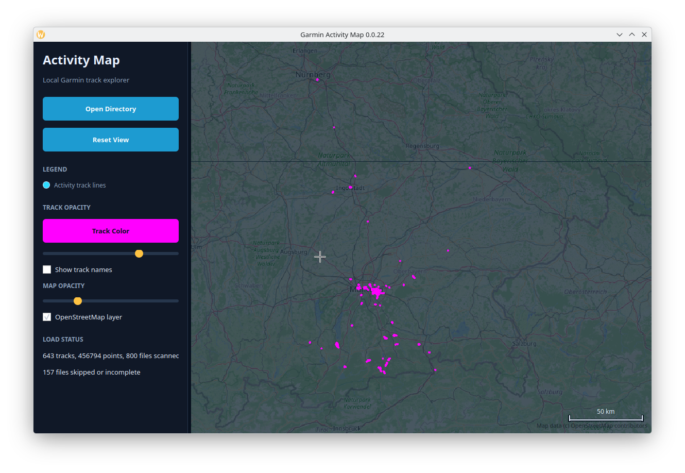

# Garmin Activity Map

[](https://github.com/marcelpetrick/GarminActivityMap/actions/workflows/local-pipeline.yml)
[](https://github.com/marcelpetrick/GarminActivityMap/releases)
[](https://www.python.org/)
[](localPipeline.sh)
[](LICENSE)

A private-first archive tool for turning a Garmin Connect account into a local, reusable activity dataset. It pulls activity summaries and detail payloads into JSON files so future analysis, dashboards, and visualizations can work from your own disk instead of repeatedly touching the Garmin service.

## TL;DR

After completing the setup below, export all activities from 2017 through 2026:

```bash
export GARMIN_EMAIL='garmin-user@example.com'
./exportGarminYears.sh --start-year 2026 --end-year 2017
```

Enter your Garmin password and MFA code when prompted. The export is resumable,
so the same command can be run again after an interruption.

Open all exported years in the map:

```bash
source .venv/bin/activate
python -m activity_map data/garmin
```



## Project Information

**Author: Marcel Petrick <mail@marcelpetrick.it>**

**License: GPLv3 or later. See `LICENSE`.**

**Note: project is generated with AI.**

- Version: `0.0.96`
- Runtime: Python 3.14 (the version used for development, the local pipeline, and CI)

## Project Size

<!-- project-metrics:start -->

Measured for version `0.0.96` with `python scripts/project_metrics.py`.

| Area | Files | Lines | Code lines | Classes | Functions |
|---|---:|---:|---:|---:|---:|
| Application (activity_map) | 18 | 3,965 | 3,433 | 30 | 253 |
| Exporter (garmin_export) | 7 | 1,508 | 1,310 | 10 | 74 |
| Tests | 27 | 5,464 | 4,463 | 21 | 322 |
| Benchmarks | 2 | 503 | 443 | 1 | 17 |
| Tooling scripts | 3 | 419 | 357 | 1 | 23 |
| **Total** | **57** | **11,859** | **10,006** | **63** | **689** |

| Property | Value |
|---|---|
| Test functions | 218 |
| Test cases collected by pytest | 286 |
| Coverage threshold | 95% enforced by the pipeline |
| Quality gates | 12 in `localPipeline.sh` |
| Runtime dependencies | 5, all pinned exactly |
| Development dependencies | 9, all pinned exactly |
| Complexity ceiling | no function above radon grade C |
| Python | 3.14 |
| License | GPL-3.0-or-later |

Largest modules:

| Module | Lines |
|---|---:|
| `activity_map/widgets.py` | 1,335 |
| `garmin_export/cli.py` | 1,016 |
| `activity_map/loader.py` | 627 |
| `activity_map/prepared_cache.py` | 417 |
| `activity_map/render.py` | 310 |

<!-- project-metrics:end -->

Regenerate the table above after changing the code:

```bash
python scripts/project_metrics.py --write
```

Run it without `--write` to print the same report, or add `--no-collect` to skip
the pytest collection count when Qt cannot be imported.

## Usage Terms

This project is distributed under the GNU General Public License v3.0. You may use, study, modify, and redistribute it under the terms of GPLv3. The full license text is in `LICENSE`, and the package metadata declares the SPDX expression `GPL-3.0-or-later`, so the license ships inside the built wheel and source distribution.

## Setup

```bash
python -m venv .venv
source .venv/bin/activate
python -m pip install -r requirements.txt
```

Set `GARMIN_EMAIL` in your shell or in ignored local `.env`. When no usable saved session exists, the password is entered manually at runtime and is not read from files or environment variables.

```bash
read -r GARMIN_EMAIL
export GARMIN_EMAIL
```

## Export

```bash
python -m garmin_export
```

By default, exported data is written under `data/garmin/activities/`, which is ignored by git. Authentication tokens are saved in `~/.garminconnect` and restored before prompting for credentials. Override that directory with `GARMIN_TOKENSTORE` in the shell or `.env`, or with `--tokenstore`; command-line settings take precedence. Do not point the token store at a tracked repository path.

Useful options:

```bash
python -m garmin_export --output-dir data/garmin/activities --page-size 100
python -m garmin_export --no-details
python -m garmin_export --activity-type running
python -m garmin_export --start-date 2026-05-13 --end-date 2026-06-13
```

The exporter is intentionally conservative for detailed activity downloads:

- Existing activity JSON files are skipped by default so interrupted exports can resume without repeating calls.
- All Garmin requests are paced at one request per second by default; configure this with `--request-interval`.
- Detail downloads can add an extra `--detail-delay` plus random `--detail-jitter`.
- HTTP 5xx, timeout, and network failures use one bounded retry budget controlled by `--max-retries`, `--backoff-initial`, and `--backoff-max`. HTTP 429 respects `Retry-After` (including HTTP dates), or waits at least 60 seconds when no usable header is available; the server's delay is never shortened by `--backoff-max`.
- HTTP 401/403 stops the run immediately. Exhausted HTTP 429 retries stop the entire year range, preserve remaining activities as pending, and record `status: stopped` plus the reason in `export-state.json`. Request pacing is shared across year boundaries.
- During authentication, the first HTTP 403/429 (or Garmin JSON error with either status) stops login immediately, including MFA, token refresh and profile loading. A scoped transport guard prevents the pinned SDK from silently trying another fingerprint or login endpoint after a block; it is removed after authentication so export requests retain their normal retry policy. Resume later rather than repeatedly restarting login; no pacing setting can guarantee Garmin will never restrict access.
- `export-state.json` is atomically updated with completed, pending, failed, retry, and estimated-completion data. Failed activities are retried on the next run; successful payload components are checkpointed so they do not need another download.
- The initial pacing estimate counts only missing payload requests and accounts for overlapping request intervals and detail waits, including jitter. Network and disk time are additional. During downloads, the completion estimate uses measured request durations (including waits, successful retries, and checkpoint writes); listing and skipped-file processing do not affect the average. The state file records the remaining request count separately from pending activity entries.

Every run reports what it is doing without needing `--verbose`:

```text
Collecting Garmin activity list for 2025-01-01 to 2025-12-31 ...
Export plan for 2025-01-01 to 2025-12-31
  Output directory  : data/garmin/activities-2025
  Activities listed : 312 from 2025-01-02 to 2025-12-30
  Already on disk   : 300 (skipped)
  Still to download : 12
  Estimated pacing  : 1m 36s (network and disk time additional)
  310/312 activities processed; 10 downloaded, 300 already present, 0 failed; estimated completion 2026-08-14T18:22:41+00:00
Export finished for data/garmin/activities-2025 in 1m 31s
  Downloaded        : 12
  Already present   : 300
  Failed            : 0 (retried 0 times)
  Manifest entries  : 312
```

The activity list is always re-queried, because that is how new activities are
detected, but only activities whose `activities/<activity-id>.json` file is
missing are downloaded. A rerun of the same command therefore fills gaps -
newly recorded activities and activities that failed earlier - instead of
downloading the archive again. `--no-skip-existing` opts out and re-downloads
everything. Add `--verbose` for a timestamped line per Garmin request, retry,
and file write.

A detailed run also completes activities that were previously exported with
`--no-details`: a stored file that is not valid JSON containing both the
`activity` and `details` payloads is reported as `Summary only` in the plan and
those payloads are fetched. Switching from a summary-only export to a full
export therefore fills the missing detail data instead of leaving those
activities incomplete forever. A summary-only run leaves such files untouched.
Both exporter commands return a nonzero exit status when any activity remains
failed, making incomplete archives visible to shell scripts and CI jobs.

For a cautious 2026 export:

```bash
python -m garmin_export \
  --start-date 2026-01-01 \
  --end-date 2026-12-31 \
  --output-dir data/garmin/activities-2026 \
  --detail-delay 5 \
  --detail-jitter 5
```

To export full years from the current calendar year back through 2017 into
separate ignored folders, run (credentials are prompted only when needed):

```bash
./exportGarminYears.sh
```

The script writes to `data/garmin/activities-YYYY/` folders, uses
`--detail-delay 2`, `--detail-jitter 2`, and `--verbose`, and accepts extra
exporter flags at the end. For example, `./exportGarminYears.sh --no-details`
exports summaries only.

The first year is the current calendar year, so the running year's activities
are always included; `--start-year` and `--end-year` override the range. The
current year's query ends on today's local date, including today; future months
and future years are skipped, while historical years retain their full range. If the
map is missing recent activities, check that a folder for the current year
exists under `data/garmin/` and that its export completed - an interrupted run
leaves `export-state.json` with a non-zero `pending` count and writes no
`manifest.json`.

Before the first Garmin request the script prints the repository path, the
interpreter it activated, the output root, the pacing flags, the extra flags it
received, and a reminder that existing activity files are skipped. Each year
then prints its own plan and completion block, and the run ends with a per-year
summary of new, already present, and failed activities including the detected
date range per year.

Year export layout:

```text
data/
  garmin/
    activities-2025/
      manifest.json
      activities/
        123456789.json
    activities-2024/
      manifest.json
      activities/
        987654321.json
```

The unique activity file key is Garmin's activity id from `activityId`,
`activity_id`, or `id`. Existing `activities/<activity-id>.json` files are
skipped by default, so interrupted year exports can be rerun without
overwriting already downloaded activity payloads. Each year-level
`manifest.json` is regenerated to summarize the latest run. Activity and
manifest JSON files are written through a temporary file and atomically moved
into place, which avoids keeping partial files after an interrupted write.
Successful activity and detail responses are independently checkpointed in
`.partial/<activity-id>.part` within each year folder. Reruns fetch only missing
components, then publish the complete activity JSON and remove its checkpoint.
The map ignores `.part` files. Invalid response types are recorded as failures;
`--no-skip-existing` on the single-export CLI deliberately ignores checkpoints.
Date-based exports are split into calendar-month Garmin queries and then
deduplicated by activity id. Each window is explicitly paginated using
`--page-size`, with pacing and retries applied to each HTTP page request.
Pagination continues to an empty page even if Garmin caps the requested page
size; retries repeat only the failed page. Repeated pages or an excessive page
count stop the export instead of looping indefinitely.

## Visualize

```bash
python -m activity_map data/garmin/activities
```

The desktop app loads Garmin JSON exports from an ignored local directory and renders activity tracks over an OpenStreetMap base layer. Downloaded map tiles are cached under the platform cache directory (`~/.cache/GarminActivityMap/map_tiles/osm` by default, or `$XDG_CACHE_HOME`); repeat views use the local cache, and panning or zooming automatically requests newly visible tiles. Stale tiles remain visible while one background refresh is attempted. The in-memory tile set is capped at 256 images and the on-disk cache at 8,192 tiles or 512 MiB, whichever comes first, evicting the oldest entries first. Set `ACTIVITY_MAP_TILE_CACHE_DIR` to relocate that cache. Following the OpenStreetMap tile usage policy, tiles are fetched by at most two workers, with a burst of 24 downloads allowed so a fresh view fills immediately and a sustained ceiling of five downloads per second across all workers afterwards; fresh tiles already in the cache are served without any delay. The location no longer depends on the working directory the app was started from, so tiles cannot land in an unrelated project folder.

Expected local layout:

```text
data/
  garmin/
    activities/
      manifest.json
      activities/
        activity-123456789.json
        activity-987654321.json
```

Controls:

- Open Directory: choose a folder containing exported Garmin JSON files.
- Reset View: fit the visible map back to the loaded tracks.
- Track Color: choose one shared color for all rendered activity tracks.
- Track Opacity: make individual routes lighter or stronger.
- Show track names: draw each Garmin activity name near its rendered track.
- Date range: limit the map to activities recorded in a period. Both fields take a date typed as `YYYY-MM-DD`, and the `Pick` button next to each opens a calendar that writes the same format back into the field. Leave a field empty for an open-ended range, fill neither to show everything, and use `Show all dates` to clear both. The line below the fields reports how many of the loaded tracks are in range. A date is applied when you press Enter or leave the field; unparseable text is reported, highlighted, and ignored rather than silently dropping tracks. While a range is active, activities whose export carries no timestamp cannot be placed in time and are hidden.
- Map Opacity: make the OpenStreetMap base layer subtle or prominent.
- OpenStreetMap layer: toggle the map base layer while keeping tracks visible.
- Drag the map to pan, use the mouse wheel to zoom deeply around the cursor, and double-click the map to reset.
- While a directory is still loading, the map keeps fitting each newly arriving batch of tracks until you pan or zoom. Selecting another directory cooperatively cancels the superseded load so the new one can start promptly. After that the view stays where you put it, and Reset View or a double-click hands control back to automatic fitting.
- Replay over time: animate the loaded archive chronologically. The map starts empty and tracks appear in recording order, with the whole date span compressed into ten seconds regardless of how long it covers. The label reports the date currently reached and the progress. Press the button again to stop early; when the replay finishes, or is stopped, the normal view returns. A replay respects an active date range and animates only that period, and it ends by showing everything again so it can simply be started once more.
- The bottom-right scale shows one rounded 1/2/5-style distance in kilometers for the current map latitude and zoom.

The app persists the last loaded directory, last run timestamp, track color,
track-name visibility, track/map opacity, map-layer state, the active date
range, and future preference fields in `~/.config/GarminActivityMap/settings.json`. Missing or corrupt files
fall back to safe defaults. Set `ACTIVITY_MAP_SETTINGS_PATH` to use a different
location.

Map colors:

The selected track color is used for all activity tracks.

Supported Garmin export shapes include activity detail files with `geoPolylineDTO.polyline`, `activityDetailMetrics` coordinate metrics, and coordinate-like nested records. Coordinate aliases are matched as explicit latitude/longitude pairs, including separate start and end pairs. Exporter control files (`manifest.json` and `export-state.json`) are excluded from discovery and cache fingerprints. Files without usable coordinates are skipped and summarized in the app instead of stopping the load. When both detailed metric samples and summary polylines are present, the detailed samples are used as the single canonical geometry source rather than joining duplicate representations.

When timestamps are available, the loader validates their ordering and computes
geodesic segment speeds. Activity-aware speed ceilings distinguish walking,
running, cycling, swimming, and snow sports while retaining a conservative
fallback for unknown activity types; faster segments are flagged and disconnected
from rendered geometry to suppress GPS spikes. The source JSON is never changed.
Use `load_directory(path, max_speed_kmh=...)` to apply an explicit threshold.

Loaded tracks retain timestamps and altitude where available, plus per-segment
distance and speed, total distance, duration, and geographic bounds. Rendering
uses cached markers at broad zoom, simplified polylines at intermediate zoom,
and full validated geometry when zoomed in.

Parsed tracks and prepared geometry are cached in a compressed binary snapshot
under the platform cache directory for faster repeat startup and substantially
less disk and serialization overhead. Cache entries are keyed by the resolved
dataset path, the geometry parameters that produced the snapshot (level-of-detail
tolerances, simplification tolerance, segment-split distance, minimum rendered
points, and the speed threshold), plus every activity file's relative path, size,
and modification time, and are written atomically with user-only permissions.
Changing any of those parameters produces a new cache entry instead of silently
reusing geometry prepared by an older build, and superseded entries for the same
dataset are removed. Set
`ACTIVITY_MAP_PREPARED_CACHE_DIR` to relocate this cache or
`ACTIVITY_MAP_DISABLE_PREPARED_CACHE=1` to disable it.

For a headless smoke check:

```bash
QT_QPA_PLATFORM=offscreen python -m activity_map --smoke-test
```

Troubleshooting:

- If the map opens but no tracks appear, check the warning count in the left rail. The selected files may not contain GPS coordinates.
- If the GUI cannot start on a server or CI machine, use the offscreen smoke command above.
- To force the synthetic offline background for deterministic checks, run with `ACTIVITY_MAP_DISABLE_TILES=1`.
- Keep real activity directories under ignored paths such as `data/` or `exports/`; the repository uses synthetic fixtures for tests.

## Local Pipeline

```bash
./localPipeline.sh
```

The pipeline creates or reuses `.venv`, installs dependencies, checks formatting,
linting, strict typing, dead code, complexity, installed dependencies, package
architecture, documentation, package builds, unit tests, coverage, and CLI/GUI
smoke runs. It also loads, prepares, indexes, and renders 1,000 synthetic tracks
with 300 points each, failing if the load-to-first-display time exceeds eight
seconds. Coverage must remain at or above 95%. The pipeline finishes with an
aligned per-gate summary that shows PASS or FAIL plus a one-line detail for each
gate (file counts, test totals, coverage percentage, built artifacts) and exits
non-zero if any gate fails.

The GUI is also covered by offscreen end-to-end tests. These tests launch the
real main window with fabricated Garmin-shaped activity files, drive the
directory selection workflow, verify incremental loading progress, exercise map
pan/zoom interaction, and check recovery after malformed synthetic input. To run
the focused GUI coverage check:

```bash
source .venv/bin/activate

QT_QPA_PLATFORM=offscreen ACTIVITY_MAP_DISABLE_TILES=1 \
  python -m pytest tests/test_gui_e2e.py tests/test_widgets.py \
  --cov=activity_map.widgets --cov-report=term-missing --cov-fail-under=0
```

Current result for that focused check: `10 passed`; `activity_map/widgets.py`
reports 95% coverage. The total shown by that scoped command is lower because
the project-wide coverage configuration still includes non-UI modules.

## Continuous Integration

`.github/workflows/local-pipeline.yml` runs the same `./localPipeline.sh` on
GitHub Actions for pushes to `master`, `main`, and `mpe/**`, for pull requests,
and on manual dispatch. The job runs on Python 3.14, the same version used for
local development, installs the Qt runtime libraries needed for
offscreen PyQt6, exports `QT_QPA_PLATFORM=offscreen` and
`ACTIVITY_MAP_DISABLE_TILES=1` so no OpenStreetMap tiles are requested from CI,
and uploads the built packages and the generated documentation as artifacts.
The Local Pipeline badge at the top of this file reflects that workflow on
`master`. Because CI runs the identical script, a green badge means the same
formatting, lint, typing, dead-code, complexity, architecture, docs, package
build, test, coverage, performance, and smoke gates that run locally passed. The
badge stays grey until the workflow has completed a run on `master`, and GitHub
caches badge images for a short while, so it can lag a minute behind a finished
run.

The release workflow validates the shared version, reruns the pipeline, creates
an annotated tag, and publishes packages, documentation, metrics, and checksums
as a public GitHub Release. If publication fails after the tag was pushed, a
rerun verifies and reuses that tag instead of permanently skipping the release.

Before a major automated operation, create a verified checkpoint and confirm
the worktree is clean:

```bash
./localPipeline.sh
git commit
./scripts/agentPreflight.sh
```

The detailed incremental-change, rollback, and traceability rules are in
`documents/AGENTS.md`.

## Architecture Documentation

The C4-style architecture views live in `documents/architecture.md`. Build and validate the local documentation bundle with:

```bash
python scripts/build_docs.py
```

Generated documentation output is written to ignored `build/docs/`.

The detailed map runtime flow and the 2026-06-23 performance review are in
`documents/data_flow.md` and `documents/speed_improvements20260623.md`.
Reproduce the synthetic 1,000-track rendering benchmark with:

```bash
QT_QPA_PLATFORM=offscreen ACTIVITY_MAP_DISABLE_TILES=1 \
  python benchmarks/benchmark_map_render.py --tracks 1000
```

Measure synthetic file loading through the first offscreen display with:

```bash
QT_QPA_PLATFORM=offscreen ACTIVITY_MAP_DISABLE_TILES=1 \
  python benchmarks/benchmark_loading.py \
    --tracks 1000 \
    --points-per-track 300 \
    --samples 3
```

Use `--loader-workers` and `--prepare-workers` to compare concurrency settings,
`--use-prepared-cache` to report first-write and repeat-snapshot loading,
`--require-prepared-cache-benefit` to enforce that the cache is worthwhile, or
`--max-load-to-display-ms` to turn the cold measurement into a regression gate.

## Privacy

Garmin activity exports can contain names, locations, timestamps, device IDs, and route data. Keep generated files under ignored paths such as `data/` or `exports/`, and check `git status --short` before committing.
