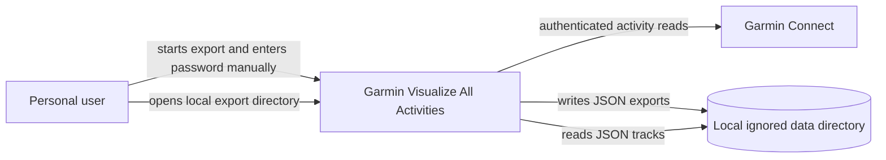
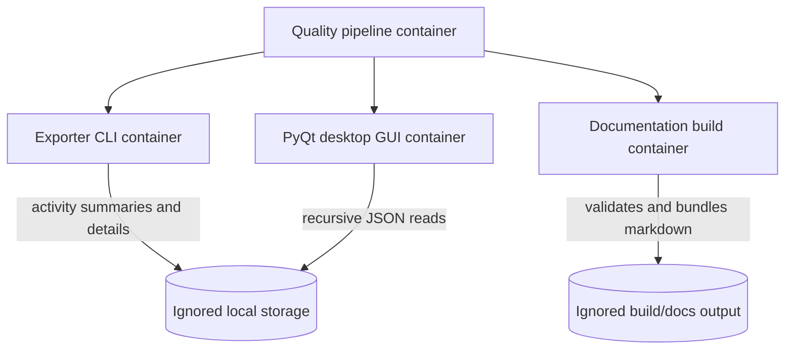
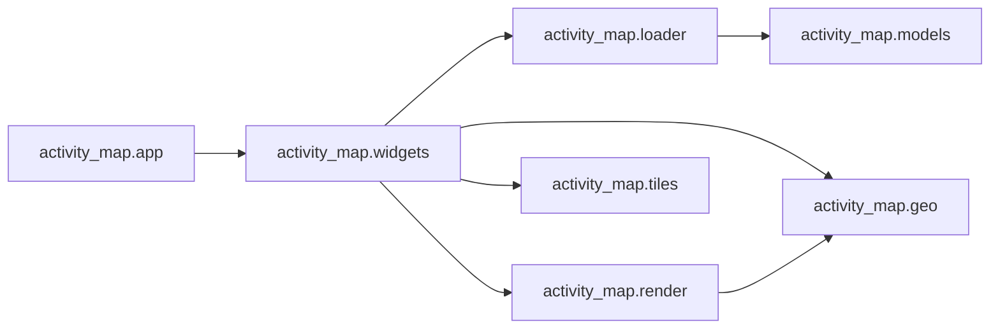
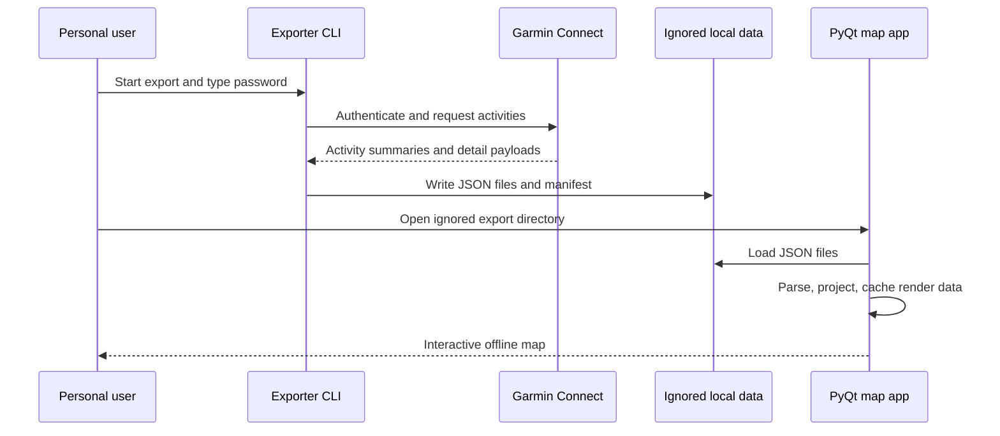

# Architecture

This document describes the project using C4-style views. It focuses on the software boundaries, runtime containers, and core components needed to export private Garmin activity data and visualize local tracks.

## Level 1: System Context

The system is a local desktop and command-line application. It authenticates only when exporting, stores activity JSON under ignored local paths, and visualizes existing local files without sending track coordinates to map providers.

## Level 2: Container View

- Exporter CLI: `garmin_export`, responsible for Garmin login, activity pagination, detail retrieval, and JSON writing.
- PyQt desktop GUI: `activity_map`, responsible for loading exports, parsing GPS tracks, projecting coordinates, and rendering the interactive map.
- Map tile cache: `activity_map.tiles`, responsible for choosing visible OpenStreetMap tiles, using a clear request identity, and caching downloaded base-map images under ignored local storage.
- Documentation build: `scripts/build_docs.py`, responsible for validating required C4 sections and producing a local documentation bundle.
- Quality pipeline: `localPipeline.sh`, responsible for bootstrap, linting, static analysis, docs build, package build, tests, and smoke runs.

## Level 3: Component View

- `activity_map.loader` recursively reads Garmin JSON files and extracts usable GPS tracks while collecting warnings for malformed or coordinate-free files.
- `activity_map.geo` owns coordinate bounds, Web Mercator projection, viewport transforms, pan, zoom, and fit behavior.
- `activity_map.render` prepares cached render data so painting can stay responsive on larger exports.
- `activity_map.tiles` chooses visible OpenStreetMap raster tiles, reads local cached tiles, and downloads missing tiles with a stable request identity.
- `activity_map.widgets` owns the PyQt window, controls, canvas drawing, and user interaction.
- `activity_map.app` provides `python -m activity_map` and the non-interactive smoke entry point.

## Level 4: Code View

The code-level design keeps private-data handling and UI rendering separated:

- Export credentials are accepted at runtime by `garmin_export.cli` and passwords are never read from files or environment variables.
- Raw Garmin payloads stay under ignored local directories such as `data/` or `exports/`.
- Downloaded map tiles stay under ignored `data/map_tiles/`.
- Parser, projection, and render-cache logic use typed pure Python objects so they can be unit tested without private data.
- PyQt widgets consume already parsed models and render caches, keeping GUI smoke tests practical in offscreen mode.
- Tests use synthetic GPS fixtures only.

## Runtime Data Flow

## Operational Constraints

- Generated docs, package builds, test caches, Garmin exports, and GUI output remain ignored.
- Documentation must build with `python scripts/build_docs.py`.
- The full local pipeline must pass before each commit.
- Any new user-facing workflow should include synthetic tests or an offscreen smoke check where practical.
