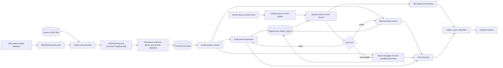
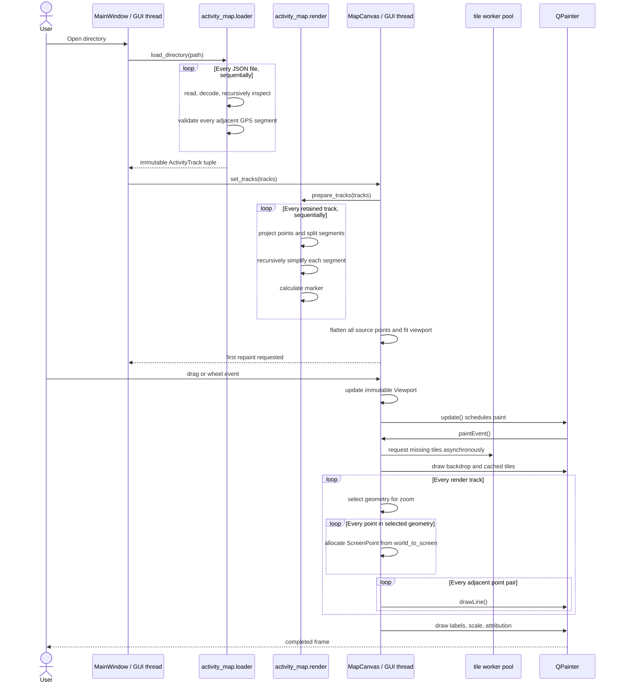
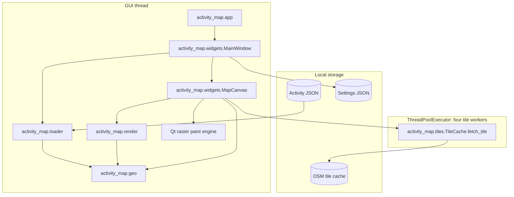

# Activity Map Data Flow and Performance Architecture

This document describes the current desktop map architecture as reviewed on
2026-06-23. It covers local JSON ingestion, render preparation, interaction,
painting, map tiles, threading, and the boundaries that determine performance.

## End-to-End Data Flow

Loading and render preparation are synchronous. `MainWindow.load_path` calls
`load_directory`, then `MapCanvas.set_tracks`, on the GUI thread. The window
cannot process interaction or repaint events until both operations complete.

## Current Runtime Sequence

The tile network and disk work is the only current parallel work. Track
loading, projection, simplification, culling, screen transformation, and
painting all execute serially on the GUI thread.

## Module and Thread Boundaries

Qt requires `QPixmap` creation and widget painting to remain on the GUI thread.
Pure data work can move off-thread: file parsing, validation, projection,
simplification, bounds, spatial indexing, and construction of immutable
render-command data. Worker results should be delivered back through queued Qt
signals and swapped atomically between frames.

## Cost Model

Let:

- `F` be JSON files;
- `T` be retained tracks;
- `P` be total GPS points;
- `S` be total selected points for the current zoom tier;
- `V` be tracks intersecting the current viewport.

The current major costs are:

| Phase | Current complexity | Thread | Important behavior |
|---|---:|---|---|
| Recursive file discovery and JSON parsing | `O(F + payload size)` | GUI | Sequential; blocks the window |
| Segment validation and full projection | `O(P)` | GUI | Haversine distance is calculated during loading and again during render preparation |
| Simplification | Typical `O(P log P)`, worst `O(P²)` | GUI | Recursive Python implementation and tuple slicing |
| Fit to tracks | `O(P)` | GUI | Re-flattens all source points despite per-track bounds already existing |
| Broad/intermediate paint | `O(T + S)` | GUI | All tracks are visited even if off-screen |
| Detailed paint | `O(T + S)` | GUI | `S` can equal `P`; one Python transform and nearly one Qt call per point/edge |
| Labels | `O(T + P)` when enabled | GUI | `track_label_anchor` scans full detailed geometry every frame |
| Tile fetch | Network/disk dependent | workers | Already asynchronous |

## Bottleneck Location

The dominant interaction cost is `MapCanvas._draw_tracks`, specifically:

1. transforming every selected projected point with
   `Viewport.world_to_screen`;
2. allocating a Python `ScreenPoint` per transformed point;
3. allocating `QPointF` objects;
4. issuing one `QPainter.drawLine` call per adjacent point pair;
5. repeating all work for every pan or zoom frame;
6. drawing every track without viewport or segment culling.

At broad and intermediate zoom, the existing marker/simplified caches are
effective. At deep zoom the renderer abruptly switches to full geometry, so a
large dataset can jump from thousands to hundreds of thousands or millions of
draw operations. The threshold is based only on global zoom, not projected
pixel error or visible density.

Map tilt is not implemented. Adding it to the current CPU raster path would
require another per-point transform and would worsen the same bottleneck.
Tilt should only be introduced after the renderer has retained geometry,
culling, and preferably GPU-backed transforms.

## Recent Commit Effects

The latest commits reviewed were `9ff3430`, `d9fca57`, `785160e`, `303032f`,
`97e5a1d`, `36718d1`, `a291e8a`, `2c2accd`, and `93be602`.

- `2c2accd` added cached full, simplified, and marker geometry. This materially
  improves broad and intermediate zoom, but deep zoom still submits full
  geometry every frame.
- `93be602` added timestamp/speed validation and invalid-segment splitting. It
  improves correctness but adds an `O(P)` loading pass; render preparation then
  performs another geodesic-distance pass to split large jumps.
- `36718d1` added settings persistence. It is not a rendering bottleneck,
  although slider changes synchronously write settings and request repaints.
- `d9fca57` synchronized controls and legend state. It has no material map
  performance effect.
- `9ff3430` raised coverage and added branch-focused GUI tests. It does not add
  a sustained frame-time or interaction performance gate.
- `a291e8a` strengthened static and architecture checks but currently does not
  benchmark rendering regressions.

The architecture remains clean at the package-dependency level, but
`activity_map.widgets` owns data loading orchestration, tile lifecycle,
interaction policy, render traversal, and low-level painting. That
concentration makes it difficult to profile, parallelize, or replace the
renderer independently.
