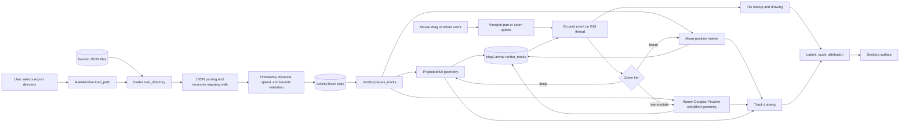
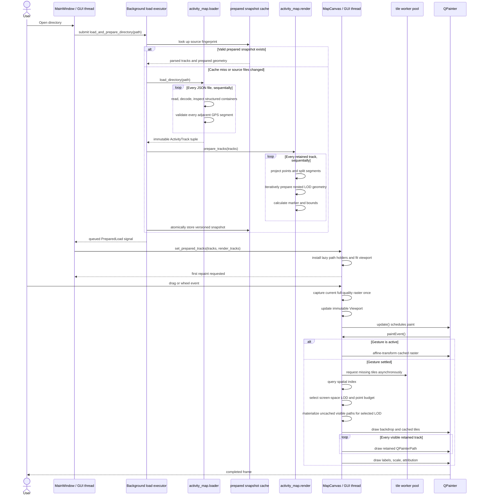
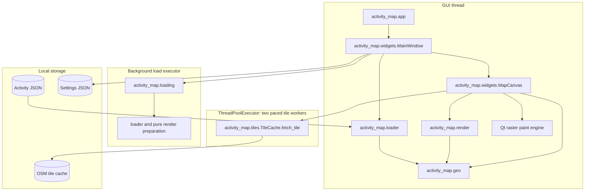

# Activity Map Data Flow and Performance Architecture

This document describes the current desktop map architecture as reviewed on
2026-06-23. It covers local JSON ingestion, render preparation, interaction,
painting, map tiles, threading, and the boundaries that determine performance.

## End-to-End Data Flow

```mermaid
flowchart LR
  U[User selects export directory]
  FS[(Garmin JSON files)]
  LD[MainWindow.load_path]
  L[loader.load_directory]
  P[JSON parsing and recursive mapping walk]
  V[Timestamp, distance, speed, and bounds validation]
  M[(ActivityTrack tuple)]
  PR[render.prepare_tracks]
  PG[Projected full geometry]
  SG[Ramer-Douglas-Peucker simplified geometry]
  MK[Mean-position marker]
  C[(MapCanvas render_tracks)]
  E[Mouse drag or wheel event]
  VP[Viewport pan or zoom update]
  PE[Qt paint event on GUI thread]
  Z{Zoom tier}
  T[Tile lookup and drawing]
  D[Track drawing]
  O[Labels, scale, attribution]
  S[Desktop surface]

  U --> LD
  FS --> L
  LD --> L
  L --> P --> V --> M
  M --> PR
  PR --> PG
  PR --> SG
  PR --> MK
  PG --> C
  SG --> C
  MK --> C
  E --> VP --> PE
  C --> PE
  PE --> T
  PE --> Z
  Z -->|broad| MK
  Z -->|intermediate| SG
  Z -->|deep| PG
  MK --> D
  SG --> D
  PG --> D
  T --> O
  D --> O
  O --> S
```

Loading and pure render preparation run asynchronously through a single
background load executor. The GUI thread immediately displays loading state,
continues processing input and paint events, and accepts the immutable
`PreparedLoad` result through a queued Qt signal. Retained `QPainterPath`
creation remains on the GUI thread but is deferred until a prepared level is
first painted.

## Current Runtime Sequence

```mermaid
sequenceDiagram
  actor User
  participant Window as MainWindow / GUI thread
  participant Worker as Background load executor
  participant Loader as activity_map.loader
  participant Cache as prepared snapshot cache
  participant Render as activity_map.render
  participant Canvas as MapCanvas / GUI thread
  participant Tiles as tile worker pool
  participant Qt as QPainter

  User->>Window: Open directory
  Window->>Worker: submit load_and_prepare_directory(path)
  Worker->>Cache: look up source fingerprint
  alt Valid prepared snapshot exists
    Cache-->>Worker: parsed tracks and prepared geometry
  else Cache miss or source files changed
    Worker->>Loader: load_directory(path)
    loop Every JSON file, sequentially
      Loader->>Loader: read, decode, inspect structured containers
      Loader->>Loader: validate every adjacent GPS segment
    end
    Loader-->>Worker: immutable ActivityTrack tuple
    Worker->>Render: prepare_tracks(tracks)
    loop Every retained track, sequentially
      Render->>Render: project points and split segments
      Render->>Render: iteratively prepare nested LOD geometry
      Render->>Render: calculate marker and bounds
    end
    Worker->>Cache: atomically store versioned snapshot
  end
  Worker-->>Window: queued PreparedLoad signal
  Window->>Canvas: set_prepared_tracks(tracks, render_tracks)
  Canvas->>Canvas: install lazy path holders and fit viewport
  Canvas-->>Window: first repaint requested

  User->>Canvas: drag or wheel event
  Canvas->>Canvas: capture current full-quality raster once
  Canvas->>Canvas: update immutable Viewport
  Canvas->>Qt: update() schedules paint
  Qt->>Canvas: paintEvent()
  alt Gesture is active
    Canvas->>Qt: affine-transform cached raster
  else Gesture settled
    Canvas->>Tiles: request missing tiles asynchronously
    Canvas->>Canvas: query spatial index
    Canvas->>Canvas: select screen-space LOD and point budget
    Canvas->>Canvas: materialize uncached visible paths for selected LOD
    Canvas->>Qt: draw backdrop and cached tiles
    loop Every visible retained track
      Canvas->>Qt: draw retained QPainterPath
    end
    Canvas->>Qt: draw labels, scale, attribution
  end
  Qt-->>User: completed frame
```

Track loading and pure render preparation now execute away from the GUI thread.
Choosing a different directory signals the active load to stop between files or
preparation batches, allowing its replacement to begin on the single load
executor without waiting for the entire superseded dataset.
Repeat loads first validate a lightweight relative-path/size/mtime fingerprint
and reuse a versioned, compressed binary prepared snapshot when it matches.
Corrupt, missing, or stale cache entries fall back to the ordinary loader
without failing the GUI.
The loader and process-preparation APIs support multiple workers, but measured
defaults remain one worker because four threads did not improve local SSD JSON
loading and four processes were slower after serialization. Tile network and
disk work continues in an independent two-worker pool whose downloads share a
minimum interval, so the provider sees a paced request stream instead of a
burst.

## Module and Thread Boundaries

```mermaid
flowchart TB
  subgraph GUI["GUI thread"]
    APP[activity_map.app]
    W[activity_map.widgets.MainWindow]
    C[activity_map.widgets.MapCanvas]
    L[activity_map.loader]
    R[activity_map.render]
    G[activity_map.geo]
    Q[Qt raster paint engine]
  end

  subgraph WORKERS["ThreadPoolExecutor: two paced tile workers"]
    TC[activity_map.tiles.TileCache.fetch_tile]
  end

  subgraph LOAD["Background load executor"]
    LC[activity_map.loading]
    LP[loader and pure render preparation]
  end

  subgraph STORAGE["Local storage"]
    J[(Activity JSON)]
    TI[(OSM tile cache)]
    ST[(Settings JSON)]
  end

  APP --> W
  W --> L
  W --> LC
  LC --> LP
  J --> L
  W --> C
  C --> R
  L --> G
  R --> G
  C --> G
  C --> Q
  C --> TC
  TC --> TI
  W --> ST
```

Qt requires `QPixmap` creation and widget painting to remain on the GUI thread.
Pure data work can move off-thread: file parsing, validation, projection,
simplification, bounds, spatial indexing, and construction of immutable
render-command data. Worker results should be delivered back through queued Qt
signals and swapped atomically between frames.

## Cost Model

Let:

- `F` be JSON files;
- `T` be retained tracks;
- `P` be total GPS points;
- `S` be total selected points for the current zoom tier;
- `V` be tracks intersecting the current viewport.

The current major costs are:

| Phase | Current complexity | Thread | Important behavior |
|---|---:|---|---|
| Recursive file discovery and JSON parsing | `O(F + payload size)` | load worker | Sequential by measured default; does not block the window |
| Segment validation and full projection | `O(P)` | load worker | Loader-computed segment distances are reused during render preparation |
| Simplification | Typical `O(P log P)`, worst `O(P²)` | load worker | Multiple retained levels; process mode remains optional |
| Fit to tracks | `O(T)` | GUI | Combines cached projected track bounds |
| Broad/intermediate paint | `O(V + S)` | GUI | Spatial query, adaptive LOD, and retained path calls |
| Detailed paint | `O(V + S)` | GUI | Visible geometry only; selected points are budgeted |
| Labels | `O(V)` when enabled | GUI | Cached label anchors for visible tracks |
| Tile fetch | Network/disk dependent | workers | Already asynchronous |

## Bottleneck Location

The dominant interaction cost is `MapCanvas._draw_tracks`, specifically:

1. transforming every selected projected point with
   `Viewport.world_to_screen`;
2. allocating a Python `ScreenPoint` per transformed point;
3. allocating `QPointF` objects;
4. issuing one `QPainter.drawLine` call per adjacent point pair;
5. repeating all work for every pan or zoom frame;
6. drawing every track without viewport or segment culling.

At broad and intermediate zoom, the existing marker/simplified caches are
effective. At deep zoom the renderer abruptly switches to full geometry, so a
large dataset can jump from thousands to hundreds of thousands or millions of
draw operations. The threshold is based only on global zoom, not projected
pixel error or visible density.

Map tilt is not implemented. Adding it to the current CPU raster path would
require another per-point transform and would worsen the same bottleneck.
Tilt should only be introduced after the renderer has retained geometry,
culling, and preferably GPU-backed transforms.

## Status as of 2026-08-14

The commit-by-commit notes that used to live here described the state before
the performance work packages landed and are superseded by
`speed_improvements20260623.md`, which records the measured result of each
phase. The current state of this pipeline is:

- retained `QPainterPath` levels, viewport culling through a uniform grid
  index, screen-space level-of-detail selection under a vertex budget, and a
  gesture raster cache are all in place; refined 2,000-track frames measure a
  few milliseconds on the reference machine;
- loading and pure render preparation run on a background executor and publish
  prepared batches of 50 tracks, so tracks appear while the archive is still
  being read;
- parsed tracks and prepared geometry are reused from a versioned disk cache
  keyed by the source fingerprint and the geometry parameters that produced the
  snapshot;
- retained Qt paths are materialised lazily, per level, the first time a level
  is painted;
- the spatial index is extended in place as batches arrive rather than rebuilt
  per batch, and each frame performs exactly one viewport query that both the
  track and label passes consume;
- `localPipeline.sh` gates load-to-first-display for 1,000 synthetic tracks at
  eight seconds, and the same script runs in GitHub Actions.

The architecture remains clean at the package-dependency level, but
`activity_map.widgets` still owns data loading orchestration, tile lifecycle,
interaction policy, render traversal, and low-level painting. That
concentration remains the main obstacle to profiling, parallelizing, or
replacing the renderer independently, and is the natural next work package if
the renderer has to change again.
