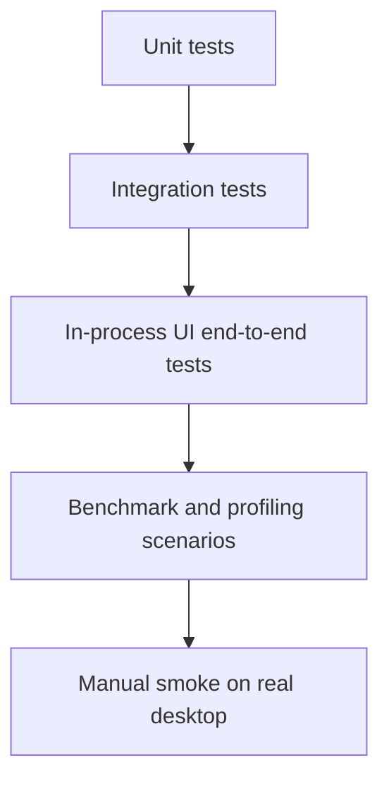

# End-to-End UI Coverage Idea

This note captures how `pytest-qt` should be used to extend coverage from widget-level checks into realistic desktop UI integration tests.

`pytest-qt==4.5.0` is the GUI-testing plugin version. It is not a Qt runtime version. The application currently uses PyQt/Qt 6, while `pytest-qt` provides the `qtbot` fixture and helpers for driving Qt widgets in tests.

## Goal

Add repeatable end-to-end coverage for the desktop workflow that matters most:

1. A user starts the application.
2. A Garmin export directory is selected.
3. Tracks appear incrementally while the archive is still loading.
4. The user pans, zooms, tilts, toggles display options, and reloads data.
5. The UI stays responsive and preserves expected state.

These tests should verify behavior and data flow, not pixel-perfect rendering. Pixel-perfect assertions are brittle on different Qt, font, DPI, platform, and graphics backends.

## Coverage Layers



- Unit tests validate pure parsing, projection, simplification, spatial indexing, settings, and render-cache logic.
- Integration tests validate loaders and prepared snapshots using synthetic activity files.
- In-process UI end-to-end tests validate the real Qt widgets without opening native dialogs or depending on network tiles.
- Benchmarks validate performance-sensitive scenarios with stable synthetic data.
- Manual smoke remains useful for real GPU, display scaling, and window-manager behavior.

## Proposed UI End-to-End Scenarios

### 1. Large directory load shows tracks incrementally

Use a temporary directory with synthetic Garmin JSON activity files.

Assertions:

- The file dialog result is monkeypatched to return the temporary directory.
- The status first enters a loading state.
- The first batch of tracks becomes visible before the final archive has completed.
- The final visible track count matches the synthetic fixture count.
- Triggering another load while the first one is still active does not clear the already visible tracks.
- Duplicate reload requests are coalesced or queued in a controlled way.

This is the regression test for the blank-map failure that can happen when asynchronous loading publishes only after the whole archive is parsed.

### 2. Map movement keeps prepared geometry usable

Load a synthetic archive, then drive viewport interaction.

Assertions:

- Pan changes the viewport.
- Zoom changes the viewport scale.
- Tilt changes the rendered transform state where supported.
- Visible-track selection still returns tracks after movement.
- Repaint completes without exceptions.
- The retained render cache is reused instead of rebuilding all geometry for every paint.

### 3. Display controls affect rendering state

Drive the controls that affect the map.

Assertions:

- Track visibility toggles change rendered output state.
- Tile visibility can be disabled for deterministic tests.
- Opacity and color controls update the render configuration.
- Track-name and marker options update canvas state without forcing a full reload.

### 4. Settings persist across application instances

Use a temporary settings path.

Assertions:

- A setting changed through the UI is written atomically.
- A new window instance restores the setting.
- Invalid settings fall back safely without breaking startup.

### 5. Error states are visible and recoverable

Use malformed and coordinate-free synthetic files.

Assertions:

- Malformed files are reported without crashing.
- Coordinate-free files do not create invisible bogus tracks.
- Loading a valid directory after an error clears or replaces the relevant status.

### 6. Responsiveness guard for the 1k-track interaction scenario

Keep this as a benchmark-backed integration scenario rather than a strict CI timing assertion.

Scenario:

1. Generate 1,000 synthetic tracks.
2. Load them into the application.
3. Pan, zoom, and tilt the map.
4. Measure frame preparation and paint-related counters.

Assertions suitable for CI:

- No interaction blocks until a full archive reload finishes.
- Rendering uses visible-track culling.
- Level-of-detail selection stays under the configured visible-point budget.
- Geometry preparation is not repeated for every paint event.

Timing thresholds should be loose or local-only unless the CI runner has stable graphics performance.

## Implementation Approach

Use `pytest-qt` for in-process UI tests:

```python
def test_large_directory_load_shows_tracks_incrementally(qtbot, monkeypatch, tmp_path):
    directory = make_activity_directory(tmp_path, track_count=1000)
    window = ActivityMapWindow()
    qtbot.addWidget(window)

    monkeypatch.setattr(
        QFileDialog,
        "getExistingDirectory",
        lambda *args, **kwargs: str(directory),
    )

    qtbot.mouseClick(window.load_button, Qt.MouseButton.LeftButton)

    qtbot.waitUntil(lambda: window.visible_track_count > 0, timeout=5000)
    qtbot.waitUntil(lambda: window.total_track_count == 1000, timeout=30000)
```

The exact widget and attribute names should follow the production API. If the UI currently lacks observable properties such as `visible_track_count`, add small test-friendly read-only accessors instead of scraping paint pixels.

## Test Environment Rules

- Run with `QT_QPA_PLATFORM=offscreen` in CI.
- Disable network map tiles for deterministic tests, for example with `ACTIVITY_MAP_DISABLE_TILES=1`.
- Use temporary directories and synthetic GPS fixtures only.
- Monkeypatch native file dialogs rather than interacting with OS dialogs.
- Prefer `qtbot.waitUntil(...)` for asynchronous state instead of fixed sleeps.
- Assert model, viewport, status, and render-cache state rather than exact pixels.
- Keep large scenarios marked separately if they are too slow for the default test suite.

## Required Test Helpers

Add shared helpers for:

- creating synthetic Garmin activity JSON files;
- creating large deterministic track directories;
- launching the main window with temporary settings and disabled tiles;
- waiting for loading completion or first-batch publication;
- driving pan, zoom, and tilt events;
- collecting render counters or cache-hit counters for regression checks.

## Acceptance Criteria

The first work package should be considered complete when:

- A pytest-qt test starts the real main window in offscreen mode.
- A synthetic directory load is triggered through the same public UI action a user would use.
- Tracks become visible before the final large load completes.
- A pan or zoom interaction after load leaves tracks visible.
- The test runs in `./localPipeline.sh`.
- No private Garmin data or network tile access is required.

## Follow-Up Work

After the first end-to-end test is stable:

1. Add interaction coverage for pan, zoom, tilt, reset, and display toggles.
2. Add malformed-file and recovery scenarios.
3. Add settings-persistence coverage.
4. Add benchmark markers for the 1,000-track pan/zoom/tilt scenario.
5. Compare benchmark output before and after further rendering changes.
