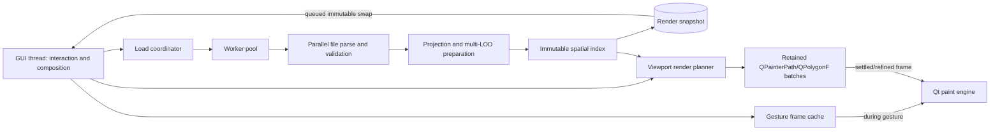

# Activity Map Speed Improvement Plan — 2026-06-23

## Executive Summary

The multi-second desktop stutter is caused primarily by synchronous detailed
track painting, not by OpenStreetMap tile loading. With 1,000 synthetic tracks
and 300 points per track, broad and simplified rendering stay near a 16.7 ms
60-FPS budget, while full-geometry rendering takes hundreds of milliseconds per
frame. Larger real exports can cross into seconds because work scales with all
selected points, even when most tracks are outside the viewport.

The highest-value fix is to stop rebuilding and submitting full geometry from
Python on every interaction frame. The target architecture should:

1. load and prepare data away from the GUI thread;
2. index tracks spatially and cull non-visible geometry;
3. prebuild retained vector geometry at several pixel-error levels;
4. use one batched path draw per color/layer instead of one `drawLine` call per
   edge;
5. render a cached map image during active gestures and refine after input
   settles;
6. move to a GPU-backed scene only if the optimized Qt raster path cannot meet
   the frame budget.

## Reproducible Benchmark

Run the synthetic benchmark without private Garmin data:

```bash
source .venv/bin/activate
python benchmarks/benchmark_map_render.py \
  --tracks 1000 \
  --points-per-track 300 \
  --frames 12
```

The benchmark measures:

- render preparation;
- `MapCanvas.set_tracks`, including render preparation and viewport fitting;
- marker-tier frames;
- simplified-tier frames;
- full-geometry frames;
- repeated deep-zoom pans;
- repeated deep-zoom wheel zooms.

It intentionally disables network tiles and uses offscreen Qt. This isolates
CPU-side track rendering. Run it on the target desktop with the normal display
backend as a second data point. Record CPU, Python, Qt, resolution, track count,
point count, median, p95, and maximum frame time.

Tilt is not benchmarked because the application has no tilt state or
perspective renderer. Tilt should be treated as a future renderer requirement,
not as a current interaction case.

## Baseline Evidence

Baseline captured on 2026-06-23:

- CPU: Intel Core i9-12900H;
- operating mode: Linux, offscreen Qt;
- Python: 3.14.5;
- PyQt/Qt: 6.11.0;
- canvas: 1200 × 760;
- dataset: 1,000 tracks × 300 points = 300,000 source points;
- tiles: disabled;
- labels: disabled.

Observed initial run:

| Scenario | Result |
|---|---:|
| `prepare_tracks` | about 529 ms |
| Broad zoom, marker geometry | about 12 ms median |
| Intermediate zoom, simplified geometry | about 12 ms median |
| Deep zoom, full geometry | about 449 ms median |

The cProfile sample for one detailed frame reported approximately:

| Operation | Calls | Cumulative/own time |
|---|---:|---:|
| `Viewport.world_to_screen` | 300,780 | 210 ms cumulative |
| `draw_polyline` | 1,018 | 383 ms cumulative |
| `QPainter.drawLine` | 299,756 | 172 ms own time |

These figures are environment-specific, but the call counts establish the
scaling problem. A 60-FPS frame has 16.7 ms; a 30-FPS frame has 33.3 ms. The
measured detailed path exceeds those budgets by roughly one order of magnitude.

## Findings by Priority

### P0 — Detailed Paint Traverses and Draws Too Much

`MapCanvas._draw_tracks` visits every track, transforms every selected point,
and draws every edge. There is no viewport culling and no clipping before
Python work. Qt clipping prevents off-screen pixels from being committed, but
it does not avoid Python transforms and draw-call submission.

Expected impact: dominant. This is where most interactive time is wasted.

### P0 — Excessive Python-to-Qt Draw Calls

`draw_polyline` calls `QPainter.drawLine` once per edge. Crossing the Python/C++
boundary hundreds of thousands of times per frame is expensive. Qt provides
batched primitives such as `QPainterPath`, `QPolygonF`, and
`QPainter.drawPolyline`.

Expected impact: dominant. Batching should reduce both Python loop overhead and
Qt call overhead.

### P0 — Full Geometry Is Selected by a Fixed Zoom Threshold

At `SIMPLIFIED_MAX_ZOOM + 1`, all tracks switch to full detail regardless of
screen-space error, density, visibility, or track length. This creates a sharp
performance cliff.

Expected impact: high. Geometry level should be selected from pixel error and
the frame budget, with multiple levels of detail rather than one simplified
copy.

### P1 — Loading and Preparation Block the GUI

Directory walking, file reads, JSON decoding, recursive extraction, validation,
projection, simplification, and viewport fitting all run synchronously in
`MainWindow.load_path`/`MapCanvas.set_tracks`. A 2,000-track import can freeze
the whole window before the first frame.

Expected impact: high for startup and reload responsiveness; lower for pan/zoom
frame time.

### P1 — Duplicate Full-Dataset Work

- Loading computes haversine distance for every adjacent point.
- Render preparation computes haversine distance again for large-jump
  splitting.
- Tracks already store bounds, but `reset_view` flattens all source points and
  recalculates global coordinate bounds.
- Marker calculation sums latitude and longitude in separate passes.
- Labels recalculate anchors by flattening detailed geometry on every frame.

Expected impact: medium. These costs are avoidable and matter during load or
when labels are enabled.

### P1 — No Spatial Index or Visibility Set

The model has geographic bounds per track, but rendering does not use them.
There is no R-tree, quadtree, grid, or even linear bounding-box rejection
against the current viewport.

Expected impact: high at deep zoom, where the visible region normally contains
only a small fraction of the archive.

### P2 — Widget Layer Has Too Many Responsibilities

`activity_map.widgets` combines controller behavior, data loading, tile
asynchrony, render selection, and low-level drawing. The pure rendering code
only selects geometry; it does not produce a testable render plan.

Expected impact: architectural. Separating a render planner makes culling,
level-of-detail selection, frame metrics, and parallel preparation testable
without a widget.

### P2 — Antialiasing and Decorative Layers Are Always Repainted

The gradient, synthetic backdrop, tiles, tracks, scale, and attribution are
redrawn for each frame. The backdrop repeatedly projects fixed latitude and
longitude samples. Antialiasing is enabled globally even when dense geometry
cannot visibly benefit.

Expected impact: low to medium after the track bottleneck is fixed.

## Target Architecture



The GUI thread should mutate only viewport/input state and compose already
prepared render data. Worker threads should never touch `QWidget` or `QPixmap`.
They may safely produce Python numeric arrays, bounds, indexes, and immutable
commands. `QImage` can be used with care off-thread, but the first implementation
should keep final Qt object creation and painting on the GUI thread.

## Parallelization Strategy

Parallelization can help before painting, but it cannot compensate for
submitting hundreds of thousands of individual draw calls.

Safe work to parallelize:

- independent JSON file reads and parsing;
- per-track timestamp/distance validation;
- per-track projection;
- per-track multi-level simplification;
- per-track bounds and label anchors;
- spatial-index construction;
- optional generation of numeric vertex buffers.

Recommended execution model:

1. A `LoadCoordinator` starts a bounded worker pool.
2. Each worker returns an immutable prepared-track result or warning.
3. The coordinator reports progress through queued Qt signals.
4. Results are ordered deterministically by source path/activity id.
5. A final immutable render snapshot is swapped onto the GUI thread.
6. Cancellation uses a generation token so stale directory loads cannot
   overwrite newer selections.

Python threads may be limited by the GIL for JSON traversal and pure-Python
geometry. Benchmark both:

- a small `ThreadPoolExecutor` for I/O-heavy file loading;
- a `ProcessPoolExecutor` for projection/simplification if serialization cost
  is lower than compute savings.

Do not send the complete object graph back and forth repeatedly. Use one task
per file or chunk, return compact prepared arrays, and keep the pool bounded.

## Implementation Plan

### Phase 0 — Establish Performance Gates

- Keep `benchmarks/benchmark_map_render.py` as the reproducible macrobenchmark.
- Add lightweight instrumentation around load, preparation, render planning,
  and paint.
- Record point counts, selected LOD points, visible tracks, draw calls, and
  frame time.
- Define target budgets on the reference desktop:
  - pan/zoom median below 16.7 ms where practical;
  - p95 below 33.3 ms;
  - no single interaction frame above 100 ms;
  - first usable frame within 250 ms, with loading continuing in background.
- Keep timing assertions out of ordinary CI until a stable dedicated runner is
  available; compare benchmark artifacts instead.

Exit criterion: repeatable baseline and per-frame counters explain regressions.

### Phase 1 — Batch Existing Geometry

- Replace per-edge `drawLine` calls with retained `QPainterPath` or
  `QPolygonF` objects.
- Build paths once per track/LOD, or merge all same-style tracks into a small
  number of layer paths.
- Set the pen once per layer rather than once per track.
- Cache label anchors during preparation.
- Cache the static synthetic backdrop.

Expected result: large reduction in Python and Qt call overhead without changing
visual output.

Exit criterion: detailed benchmark draw calls fall from `O(edges)` to
`O(visible batches)` and frame time improves materially.

### Phase 2 — Cull Before Transform and Paint

- Add projected bounds to each prepared track and segment.
- Convert the viewport to projected world bounds.
- Reject off-screen tracks before selecting or transforming geometry.
- Add a simple uniform grid first; adopt an R-tree only if measurements justify
  the dependency and complexity.
- Clip long segments to an expanded viewport to avoid processing distant
  vertices.

Expected result: deep-zoom work becomes proportional to visible geometry, not
the entire archive.

Exit criterion: panning a local area with 2,000+ loaded tracks visits only the
visible candidates and remains within the p95 budget.

### Phase 3 — Replace Fixed LOD With Screen-Space LOD

- Precompute several simplification levels per segment.
- Store tolerances in projected-world units or use a hierarchy that can select
  a pixel-error target at runtime.
- Choose LOD from `tolerance_pixels / viewport.zoom`.
- Add a frame-budget guard that selects a coarser LOD when visible vertex count
  exceeds a configured ceiling.
- Cross-fade or use hysteresis around LOD changes to avoid popping.

Expected result: no performance cliff immediately above a global zoom
threshold; detail increases gradually and only where visible.

Exit criterion: zoom sequences show bounded vertex counts and smooth frame
times.

### Phase 4 — Make Load/Preparation Asynchronous

- Move directory loading and render preparation behind a coordinator.
- Stream progress and warnings to the side panel.
- Keep the previous snapshot visible while a new directory loads.
- Publish partial batches if useful, but avoid repainting for every file;
  throttle UI updates to roughly 10 Hz.
- Reuse prepared geometry from a versioned disk cache keyed by source file
  identity, modification time, size, parser version, and render settings.

Expected result: the UI remains responsive during 1,000–2,000-track loading and
repeat startup becomes mostly cache reads.

Exit criterion: user input and window repaint continue during loading; stale
tasks cancel cleanly.

### Phase 5 — Gesture-Aware Rendering

- On mouse press/wheel bursts, immediately transform a cached composite image
  for visual continuity.
- Schedule one refined vector frame after a short idle interval, for example
  40–80 ms.
- Coalesce wheel events and discard render plans for obsolete viewport
  generations.
- Consider temporarily reducing antialiasing or LOD during active gestures.

Expected result: perceived interaction remains fluid even when a final
high-quality frame needs longer.

Exit criterion: drag and zoom feedback stays under one display frame while the
refined frame arrives asynchronously or after input settles.

### Phase 6 — Evaluate GPU Rendering and Tilt

Only after Phases 1–5 are measured:

- prototype `QOpenGLWidget`, Qt Quick scene graph, or another retained GPU
  layer;
- upload projected vertices once and apply pan/zoom in a transform matrix;
- keep multiple LOD/index buffers and spatially selected batches;
- implement tilt as a camera matrix with GPU clipping.

GPU rendering is justified if visible detailed geometry still cannot meet the
frame budget after batching, culling, and LOD. A GPU rewrite before those data
structures exist would move complexity without fixing overdraw and selection.

Exit criterion: a prototype demonstrates a substantial measured improvement
and preserves offscreen/testability requirements.

## Recommended First Work Package

Implement Phases 1 and 2 together as a contained renderer refactor:

1. introduce `PreparedSegment`/`PreparedTrack` bounds and cached label anchor;
2. introduce a pure `RenderPlanner` that returns visible geometry and counters;
3. build batched `QPainterPath` objects per LOD;
4. paint one or a few batches per layer;
5. add benchmark output for visible tracks, selected vertices, and draw calls;
6. add regression tests for culling and LOD selection;
7. rerun the 1,000-track benchmark and compare median/p95.

This work addresses the measured hot path directly and creates the seam needed
for later parallel loading or a GPU backend.

## Implementation Results

### Phase 1 — Retained Paths and Transform-Based Painting

Implemented in version `0.0.34`:

- retained `QPainterPath` objects for simplified and detailed geometry;
- one Qt path submission per track instead of one `drawLine` per edge;
- one viewport `QTransform` applied by Qt instead of Python screen-coordinate
  conversion for every point;
- cosmetic pens so line width remains constant under the world transform;
- cached label anchors.

Synthetic benchmark result for 1,000 tracks × 300 points on the baseline
machine:

| Scenario | Before | After | Improvement |
|---|---:|---:|---:|
| Intermediate geometry | about 12 ms | about 4 ms | about 3× |
| Detailed geometry | about 485 ms | about 66 ms | about 7.3× |
| Detailed pan | about 488 ms | about 65 ms | about 7.5× |
| Detailed wheel zoom | about 485 ms | about 67 ms | about 7.2× |

`MapCanvas.set_tracks` increased from about 566 ms to about 733 ms because the
retained paths are constructed once at load time. This is an explicit
compute/memory trade: more preparation and retained geometry remove repeated
per-frame Python work. The remaining detailed-frame cost is still above the
33.3 ms 30-FPS budget, so viewport culling and spatial selection remain
necessary.

### Phase 2 — Viewport Culling and Spatial Index

Implemented in version `0.0.35`:

- projected bounds cached for each prepared track;
- a uniform-grid spatial index built once with the render snapshot;
- viewport queries expanded by a small paint margin;
- the same visible candidate set used for track paths and labels;
- benchmark counters for visible tracks and submitted path calls.

Synthetic benchmark result for 1,000 tracks × 300 points:

| Scenario | Phase 1 | Phase 2 | Visible paths |
|---|---:|---:|---:|
| Detailed geometry | about 66 ms | about 17 ms | 156 / 1,000 |
| Detailed pan | about 65 ms | about 18 ms | about 180 / 1,000 |
| Detailed wheel zoom | about 67 ms | about 20 ms | about 140 / 1,000 |

Deep-zoom interaction now runs at roughly 50–59 median FPS in the synthetic
scenario. Broad and intermediate views legitimately intersect all tracks and
continue to cost about 4–7 ms. The next optimization should address datasets
where many dense tracks overlap in the same visible region by selecting
screen-space LOD from an explicit vertex budget.

## Risks and Guardrails

- `QPixmap` and widgets must stay on the GUI thread.
- A single enormous `QPainterPath` may have expensive rebuild/copy behavior;
  benchmark per-layer versus spatial-tile batches.
- Process-pool startup and serialization can make small loads slower; enable it
  only above a measured threshold.
- Simplification must preserve segment breaks and must not reconnect invalid
  GPS jumps.
- Spatial culling must handle viewport boundaries and normalized world limits.
- Disk caches must be versioned and remain under ignored local storage because
  prepared geometry is still sensitive location data.
- Performance tests must use synthetic routes only.

-----

## Benchmark `before`

```
python benchmarks/benchmark_map_render.py \
    --tracks 1000 \
    --points-per-track 300 \
    --frames 12

# Activity map rendering benchmark

- Platform: Linux-7.0.10-1-MANJARO-x86_64-with-glibc2.43
- Python: 3.14.5
- Tracks: 1,000
- Points per track: 300
- Total source points: 300,000
- Canvas: 1200 × 760
- Samples per scenario: 12
- `prepare_tracks`: 550.32 ms
- `MapCanvas.set_tracks`: 565.41 ms

| Scenario | Median | p95 | Maximum | Median FPS |
|---|---:|---:|---:|---:|
| broad zoom (markers) | 12.48 ms | 12.89 ms | 12.89 ms | 80.1 |
| intermediate zoom (simplified) | 12.94 ms | 13.25 ms | 13.25 ms | 77.3 |
| deep zoom (full geometry) | 497.48 ms | 503.67 ms | 503.67 ms | 2.0 |
| deep-zoom pan | 497.22 ms | 509.58 ms | 509.58 ms | 2.0 |
| deep-zoom wheel zoom | 498.13 ms | 508.29 ms | 508.29 ms | 2.0 |
```
